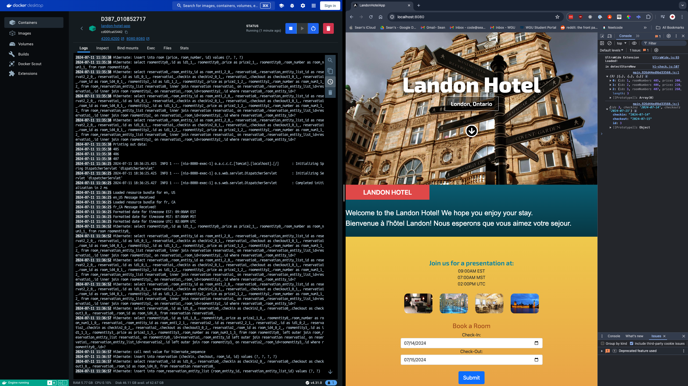

# Landon Hotel

#### This MVP website was built to provided specifications for my college course D387.

# _Advanced Java_

#### By _**Sean Keane**_

#### WGU Code Review 07/11/2024

## Description

_I created a Java project for my B.S. in Software Engineering that manages hotel bookings for the Landon Hotel. The user is greeted with a welcome message both in French and English. The messages are accomplished through the use of threads. The customer can select dates they would like to book, which dynamically loads the rooms available, along with their prices in USD, CAD, and EUR. Developing this application helped me grow my understanding of Java, front-end development, and Docker._

### Built Application

## Technology Used

* Java
* Spring Framework (Spring Boot, Spring Data JPA, Spring Data REST)
* HTML
* CSS
* Docker

## Setup/Installation Requirements

1) Clone this repository to your desktop.
2) Navigate to the now installed directory and open in your editor of choice.
3) Run the project by clicking the play button. This is next to 'D387SampleCodeApplication' in the top right of the IDE.
4) Navigate to the UI folder in your terminal `cd src/main/UI`
5) Run `npm install`
6) Run `ng serve`
4) Open your browser of choice and navigate to Backend API: http://localhost:8080 and Frontend Application: http://localhost:4200

## Known Bugs

* No known bugs.

## License

If you have any questions or concerns, feel free to contact me at code@sean-keane.com

*This is licensed under the MIT license*

Copyright (c) 07-11-2024 **_Sean Keane_**